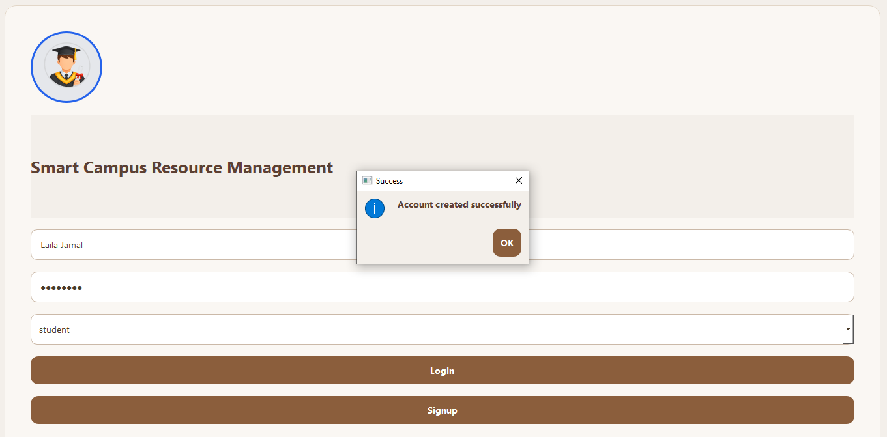
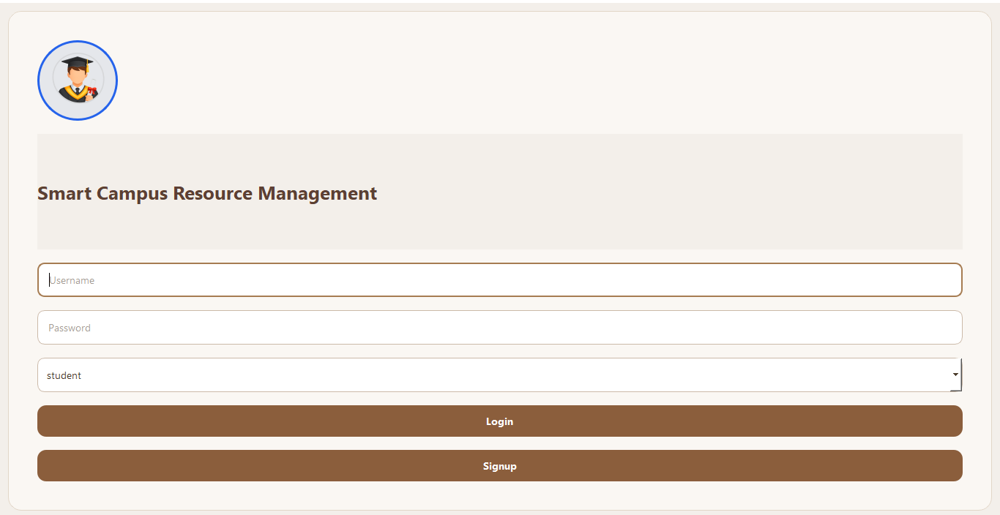
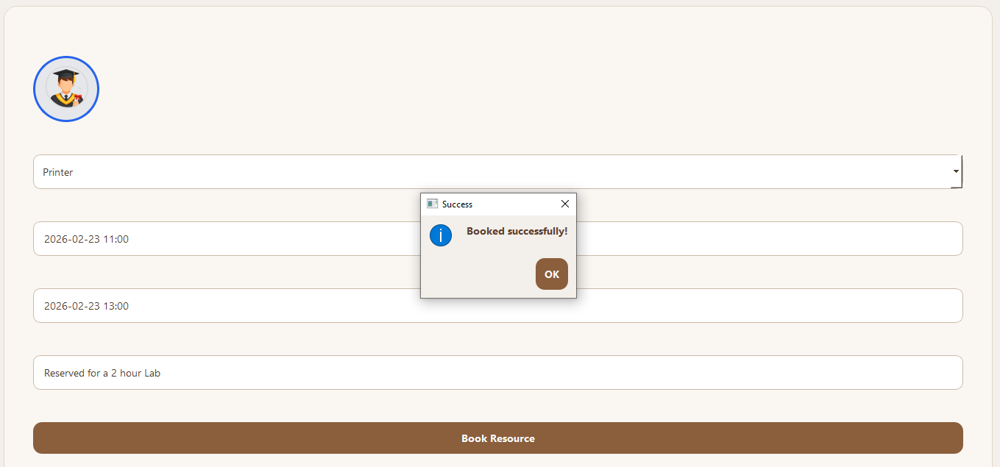
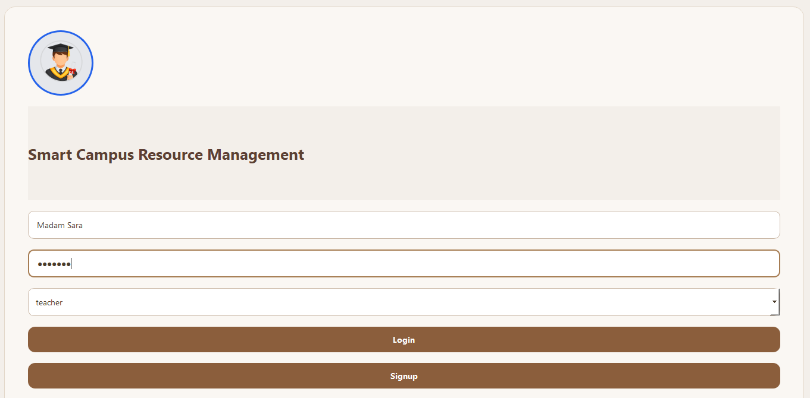
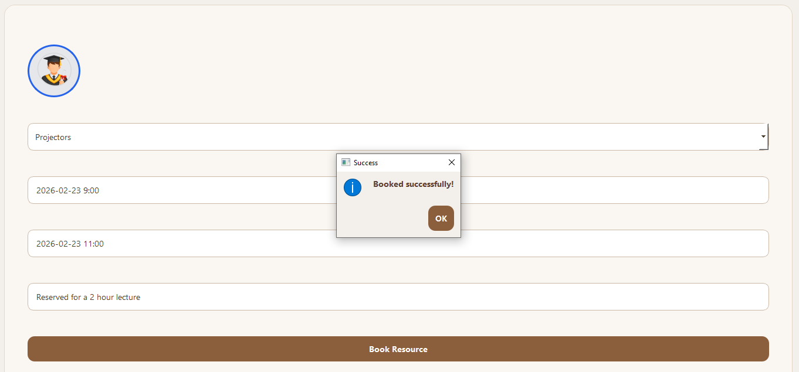
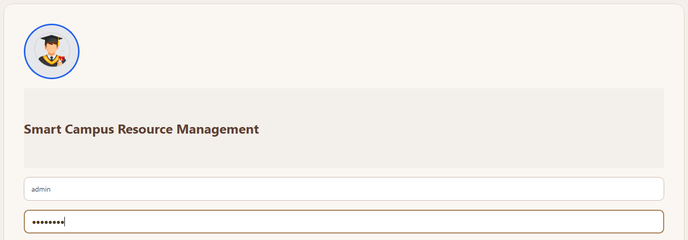
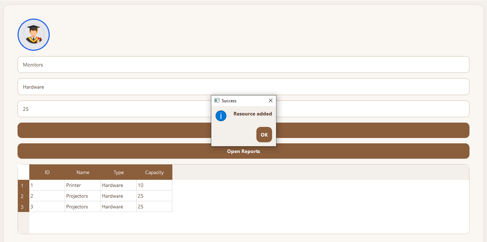
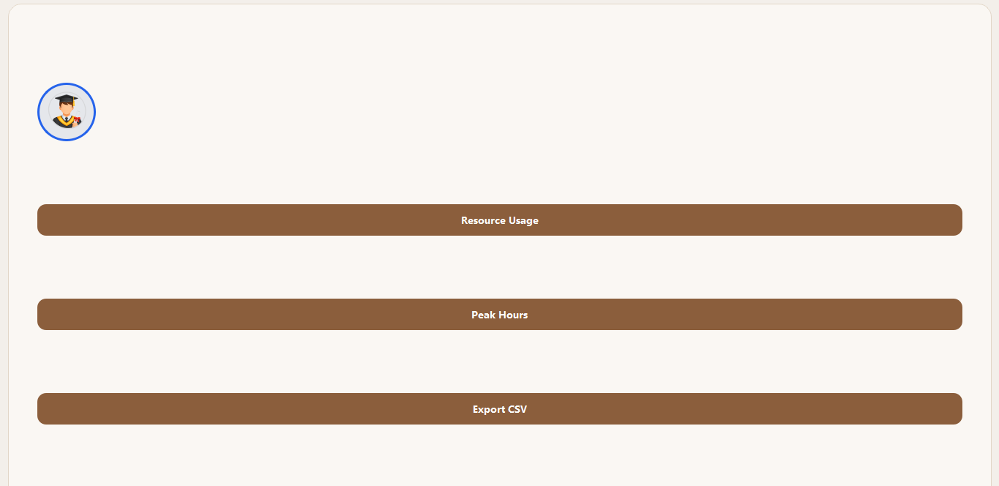
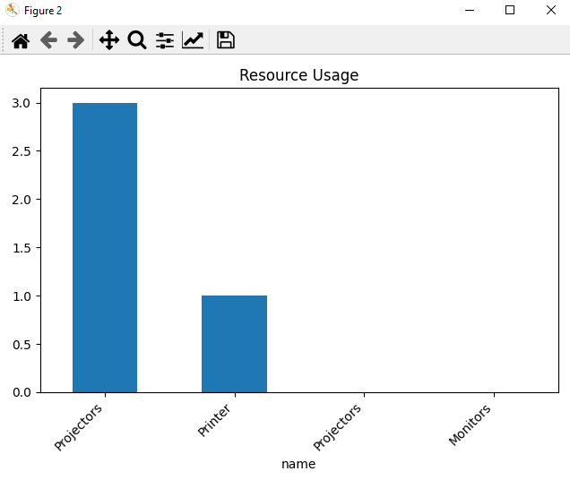
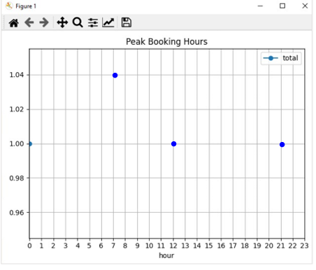

# 🏫 Smart Campus Resource Management System
## 📌 Project Overview

A Desktop Application built using Python + PyQt5 to simulate real-world campus resource booking workflows.

This system enables role-based resource management for:

- 👨‍💼 Admins

- 👩‍🏫 Teachers

- 🎓 Students

## Main Flow
- Admins through login can add, remove resources as well as view resource usage graph, peak booking hours graph and export CSV files.
- Students through login and signup can book resources as well as cancel booking.
- Teachers through login and signup can book and cancel resource bookings.

## 🧠 Features

✅ User Authentication (Signup / Login)
✅ Role-Based Dashboards
✅ Resource Booking & Management
✅ Booking Conflict Detection
✅ Report Visualization
✅ Data Persistence using Database

## 🏗️ Software Architecture
- 🎨 Frontend Layer (PyQt5 UI)

- Role-based dashboards

- Interactive UI components

- Booking forms and navigation

## ⚙️ Business Logic Layer

- Access control

- Workflow validation

- Conflict detection

## 🗄️ Database Layer (SQLite)

- User management

- Resource tracking

- Booking history storage

## 🖥️ Screenshots
- Account Creation: 
This feature allows users (students & teachers) to create their accounts.

- Student Login:
Students can login to their accounts.

- Student Dashboard:
This image displays actions that students can perform such as booking a resource by entering name of resource, booking start hours, end hours and purpose of booking.

- Teacher Login:
Given image shows a teacher logging in to their account.

- Teacher Dashboard:
Given image shows teacher booking resource by entering name of resource, booking start hours, end hours as well as purpose of booking.

- Admin Login:
The image shows admin logging in.

- Admin Inventory:
The image shows admin inventory as well as admin adding a resource to the system. Total resources stored in the system can also be seen in the table.

- Admin Dashboard:
This image shows admin privileges such as graph view of resource usage, peak booking hours as well as the option to export CSV.

- Resource Usage Graph:
The image shows quick and easy view of resource usage.

- Booking Peak Hours:
Image shows peak hours of resource booking.

## 🛠️ Technologies Used

- Python

- PyQt5

- SQLite

- Matplotlib

- Event-driven programming

# 👥 Team Members

- Hamna Mahmood

- Komal Kashif

- Emaan Hanif

📦 Installation & Setup
## Clone repository
git clone https://github.com/hamna-mahmood/Smart-Campus-Resource-Management-System.git

## Navigate to project
cd repo-name

## Install dependencies
pip install pyqt5 matplotlib sqlite3

Run application:

python main.py
⭐ Future Improvements

Cloud database integration

Web version development

Advanced analytics dashboard

AI-based resource prediction

💡 Project Goals

Improve campus resource utilization

Provide efficient booking workflows

Efficient addition/removal of campus resources
